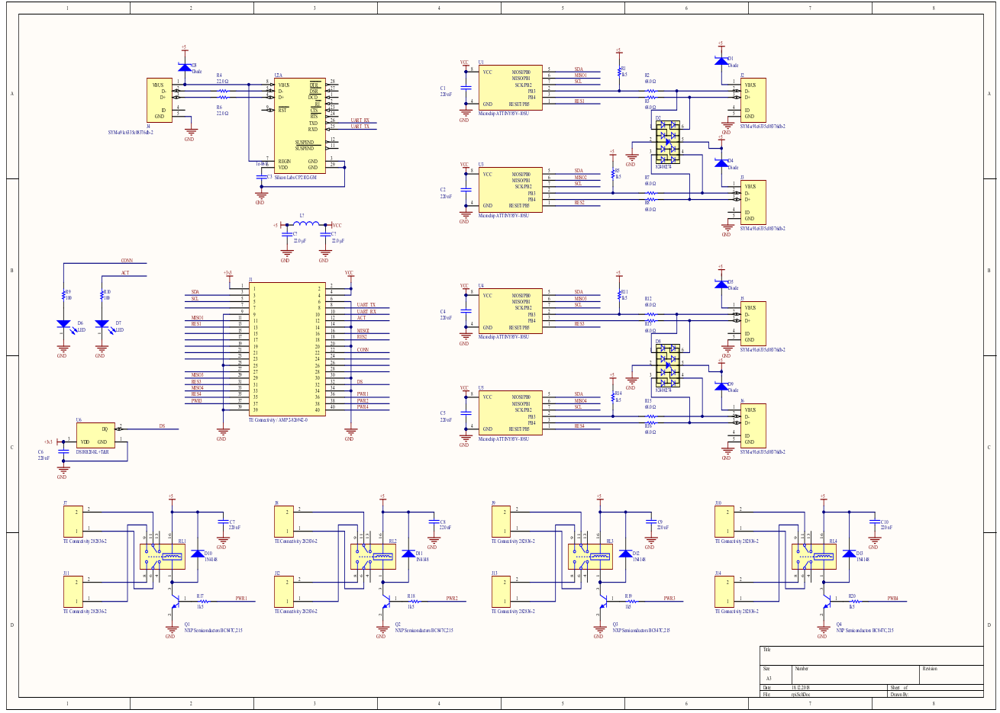
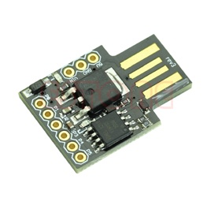
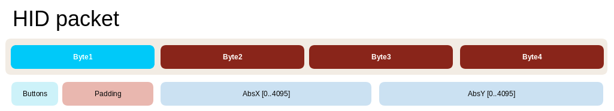
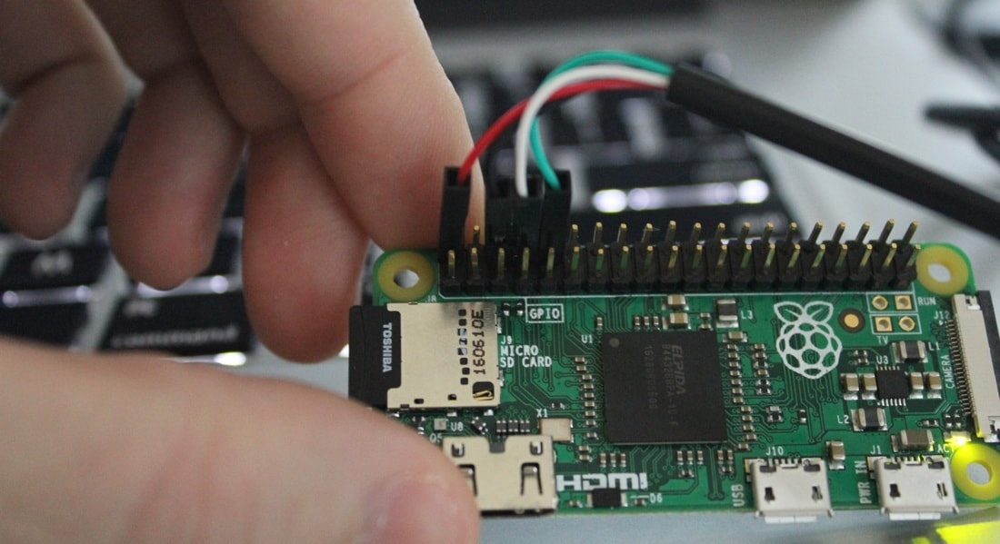

# RPi-based multichannel HID emulation

If you need to test your embedded hardware remotely, this tool sends remote mouse clicks from your web-browser

## Schematic

[Project files](https://workspace.circuitmaker.com/Projects/Details/Eugene-Krashtan-2/rpi-hid)




## How it works

Raspberry Pi as 'heart' of whole system, and custom cap with few ATTiny8 chips works as vitrual mouse
(or touchscreen/keyboard/etc). 

RPi sends commands to ATTiny via i2c bus and can use SPI bus as AVR programmer, toggles switches
using optocouplers.

From another side, RPi connects to MQTT broker and subscribes for topics with encoded mouse clicks.
In 'web' folder I put small example how to send mouse clicks directly from web-page.

## Config file

Description of MQTT channels, screen resolutions and coordinates. All RPi and console scripts read 
this file on start and use as common point to establish links.
File format, JSON:

```
{
    "MQTT": {
        "addr" : "10.11.12.1",
        "port" : 1883,
        "login" : "rpi",
        "password" : "123"
    },
    "Shelf": [
        {
            "name" : "FirstDev",
            "screen" : {
                "xsize" : 1024,
                "ysize" : 768
            },
            "remote" : {
                "X0" : 234,
                "Y0" : 12,
                "X1" : 555,
                "Y1" : 200
            }
        },
        {
            "name" : "AnotherDev",
            "screen" : {
                "xsize" : 800,
                "ysize" : 600
            }
        }
    ],
    "HID": [
        {
            "name" : "FirstDev",
            "device" : "rpi1",
            "topic" : "/aaa/bbb/1",
            "port" : 38
        },
        {
            "name" : "AnotherDev",
            "device" : "rpi1",
            "topic" : "/aaa/ccc/1",
            "port" : 40
        }
    ]
}
```

## MQTT commands

Topic (defined in config) - for HID number;

Message in format "XXX,YYY,B" (three comma-separated digits without spaces)

## i2c commands

Byte1 - Magic number indicating packet start. Arduino library doesn't support start/stop
indication between bytes.

###### Todo: omit this byte and use start event instead

Byte2, Byte3, Byte4 - X and Y coordinates 12 bits long

Byte5 - button state \[xxxxxRML] (R- right, M- middle, L- left)

## HID emulator

Based on ATTiny85 chip, possible to use Digispark Arduino board as prototype:



VUSB library as USB HID

**SDA** - pin1

**SCL** - pin3

**LED** - pin2

## Firmware update

Possible to reconfigure HID profiles on working equipment. (Touch Screen, Joystick, Keyboard, Mouse etc)

VUSB library as USB HID

SDA - pin1

SCL - pin3

LED - pin2

## Firmware update

Possible to reconfigure HID profiles on working equipment. (Touch Screen, Joystick, Keyboard, Mouse etc)

### Setup programmer

Based on [instructions](https://www.instructables.com/id/Programming-the-ATtiny85-from-Raspberry-Pi/)
and [this one](https://learn.adafruit.com/program-an-avr-or-arduino-using-raspberry-pi-gpio-pins/programming) 

Install avrdude programmer:

        sudo apt install avrdude

configure programmer in avrdude config file:

```
programmer
  id    = "pi_hid1";
  desc  = "Bitbang GPIO lines for first HID";
  type  = "linuxgpio";
  reset = 24;
  sck   = 3;
  mosi  = 2;
  miso  = 23;
;

programmer
  id    = "pi_hid2";
  desc  = "Bitbang GPIO lines for second HID";
  type  = "linuxgpio";
  reset = xx; <- next value
  sck   = 3;
  mosi  = 2;
  miso  = xx; <- too
;

....
```

All chips have common **SCK** and **MOSI** pins (the same with SCL and SDA for I2C communication) 
and individual **MISO** and **RESET**

Check chip connection:

        avrdude -C hids_gpio.conf -p attiny85 -c pi_hid1 -v

It should respond with fuse state and "avrdude: AVR device initialized and ready to accept instructions"

Writing procedure:

        avrdude -C hids_gpio.conf -p attiny85 -c pi_hid1 -v -U flash:w:firmware.hex

Some pins in GPIO config shared with i2c bus. To resolve conflicts remove i2c module before programming:

        rmmod i2c_bcm2835

and install it back after programming:

        modprobe i2c_bcm2835

### How to export HEX from arduino

 Just edit the Digispark's platform.txt file and add this:

```
## Create hex
....

## Save hex
recipe.output.tmp_file={build.project_name}.hex
recipe.output.save_file={build.project_name}.hex
```

### How to setup compiler

Install AVR-gcc 

        sudo apt install avr-libc gcc-avr

## HID descriptor for touchscreen mode

Supports 3 buttons and range 0..4095 for X and Y axis.

``` C
const PROGMEM unsigned char mouse_usbHidReportDescriptor[] = { /* USB report descriptor */
0x05, 0x01,        // Usage Page (Generic Desktop Ctrls)
0x09, 0x02,        // Usage (Mouse)
0xA1, 0x01,        // Collection (Application)
0x09, 0x01,        //   Usage (Pointer)
0xA1, 0x00,        //   Collection (Physical)
0x05, 0x09,        //     Usage Page (Button)
0x19, 0x01,        //     Usage Minimum (0x01)
0x29, 0x03,        //     Usage Maximum (0x03)
0x15, 0x00,        //     Logical Minimum (0)
0x25, 0x01,        //     Logical Maximum (1)
0x95, 0x03,        //     Report Count (3)
0x75, 0x01,        //     Report Size (1)
0x81, 0x02,        //     Input (Data,Var,Abs,No Wrap,Linear,Preferred State,No Null Position)
0x95, 0x01,        //     Report Count (1)
0x75, 0x05,        //     Report Size (5)
0x81, 0x01,        //     Input (Const,Array,Abs,No Wrap,Linear,Preferred State,No Null Position)
0x05, 0x01,        //     Usage Page (Generic Desktop Ctrls)
0x09, 0x30,        //     Usage (X)
0x09, 0x31,        //     Usage (Y)
0x15, 0x00,        //     Logical Minimum (0)
0x26, 0xFF, 0x0F,  //     Logical Maximum (4095)
0x75, 0x0C,        //     Report Size (12)
0x95, 0x02,        //     Report Count (2)
0x81, 0x02,        //     Input (Data,Var,Abs,No Wrap,Linear,Preferred State,No Null Position)
0xC0,              //   End Collection
0xC0,              // End Collection
};
```



## WEB script

Define screen shapes and coordinates, convert point on screen to HID coordinates inside pre-defined topic;

Use JS to convert on-screen mouse clicks into MQTT messages:

``` js
<!doctype html>
<html>
<head>
    <meta charset="utf-8">
    <title>Demo</title>
    
    <script src="https://cdnjs.cloudflare.com/ajax/libs/paho-mqtt/1.0.1/mqttws31.min.js" type="text/javascript">
    </script>
    
    <style>
    #demo-box {
        width: 200px;
        height: 200px;
        border: 1px solid powderblue;}
    </style>
    
    <script type = "text/javascript" language="javascript">
        // Create MQTT connection
        var mqtt;
        var reconn=2000;
        var host="localhost";
        var port=9001;
        
        function onConnect() {
            console.log("Connected");
        }
        function MQTTconnect() {
            mqtt = new Paho.MQTT.Client(host,port,"clientjs");
            var options = {
                timeout: 3,
                onSuccess: onConnect,
            };
            console.log("Connecting");
            mqtt.connect(options);
        }
    </script>
</head>

<body onload="MQTTconnect()">
<script src="http://code.jquery.com/jquery-latest.min.js"
        type="text/javascript"></script>
HID event sender example
    <div id="demo-box"></div>
    <script type="text/javascript">
        $(function() {
            $("#demo-box").click(function(e) {
                var offset = $(this).offset();
                var relativeX = (e.pageX - offset.left);
                var relativeY = (e.pageY - offset.top);
                
                // Sending click coordinate
                msg = new Paho.MQTT.Message(relativeX+","+relativeY+",1");
                msg.destinationName = "/aaa/bbb/1";
                console.log("Msg "+relativeX + " , " +relativeY);
                mqtt.send(msg);
                // Release mouse button
                msg = new Paho.MQTT.Message(relativeX+","+relativeY+",0");
                msg.destinationName = "/aaa/bbb/1";
                mqtt.send(msg);
            });
        });
    </script>
</body>
</html>
```

JS script requires WebSocket connection to MQTT broker. You need to make changes
in the mosquitto.conf file, by adding the following:

```
listener 9001
protocol websockets
```

## RPi Zero terminal connection

Enable UART in boot config:

      vi /boot/config.txt

insert after last line:

      enable_uart=1

Connect UART-to-USB dongle with ribbon cable:



### Required packets

      sudo apt-get install libkmod-dev
      sudo pip install kmod

